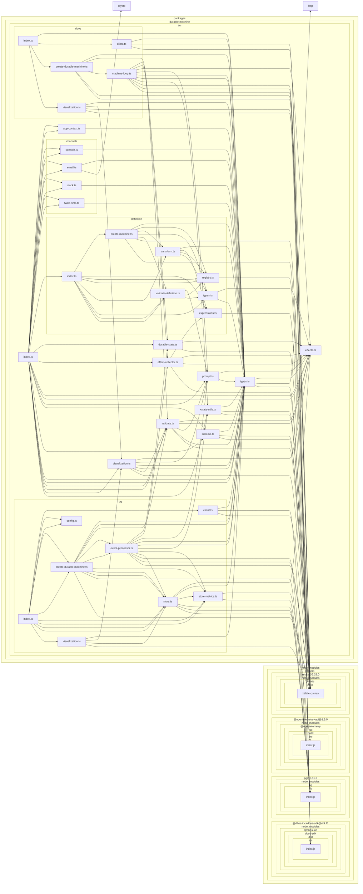

# @durable-xstate/durable-machine

Durable XState v5 state machines powered by [DBOS Transact](https://docs.dbos.dev/). Write standard XState statecharts; this library runs them as durable workflows backed by Postgres — surviving crashes, restarts, and long-term waits without custom persistence code.

## Install

```bash
npm install @durable-xstate/durable-machine xstate @dbos-inc/dbos-sdk
```

Requires Node >= 24, XState >= 5, and DBOS SDK >= 4.

## Quick start

```typescript
import { DBOS } from "@dbos-inc/dbos-sdk";
import { setup, fromPromise, assign } from "xstate";
import { createDurableMachine, durableState } from "@durable-xstate/durable-machine";

const orderMachine = setup({
  types: {
    context: {} as { orderId: string; total: number; chargeId?: string },
    events: {} as { type: "PAY" } | { type: "CANCEL" },
    input: {} as { orderId: string; total: number },
  },
  actors: {
    processPayment: fromPromise(async ({ input }: { input: { total: number } }) => {
      return { chargeId: `ch_${input.total}` };
    }),
  },
}).createMachine({
  id: "order",
  initial: "pending",
  context: ({ input }) => ({ orderId: input.orderId, total: input.total }),
  states: {
    pending: {
      ...durableState(),
      on: { PAY: "processing", CANCEL: "cancelled" },
    },
    processing: {
      invoke: {
        src: "processPayment",
        input: ({ context }) => ({ total: context.total }),
        onDone: {
          target: "paid",
          actions: assign({ chargeId: ({ event }) => event.output.chargeId }),
        },
        onError: "failed",
      },
    },
    paid: { type: "final" },
    cancelled: { type: "final" },
    failed: { type: "final" },
  },
});

// Register before DBOS.launch()
const durable = createDurableMachine(orderMachine);

DBOS.setConfig({ name: "my-app", systemDatabaseUrl: "postgresql://..." });
await DBOS.launch();

const handle = await durable.start("order-123", { orderId: "o1", total: 99.99 });
await handle.send({ type: "PAY" });
const result = await handle.getResult();
```

## Concepts

### Three kinds of states

Every non-final atomic state must be exactly one of:

| Kind | Marker | DBOS primitive | Purpose |
|------|--------|----------------|---------|
| Durable | `durableState()` | `DBOS.recv()` | Wait for external events |
| Invoking | `invoke: { src }` | `DBOS.runStep()` | Run a side effect exactly once |
| Transient | `always: [...]` | `machine.transition()` | Route immediately via guards |

This is validated at registration time — `createDurableMachine()` throws a `DurableMachineValidationError` if a state doesn't fit one of these categories.

### Durable states

Spread `durableState()` into any state that should durably wait for external input:

```typescript
pending: {
  ...durableState(),
  on: { PAY: "processing", CANCEL: "cancelled" },
},
```

The workflow loop calls `DBOS.recv()` and waits. The process can shut down, restart, or scale to zero — DBOS resumes the wait on recovery.

### Prompts

Prompts are metadata on durable states describing what to present to a human. The machine declares *what* to ask; channel adapters decide *how* to deliver it:

```typescript
awaitingApproval: {
  ...prompt({
    type: "choice",
    text: ({ context }) => `Approve order ${context.orderId} for $${context.total}?`,
    options: [
      { label: "Approve", event: "APPROVE" },
      { label: "Reject", event: "REJECT" },
    ],
  }),
  on: { APPROVE: "approved", REJECT: "rejected" },
},
```

Four prompt types: `choice`, `confirm`, `text_input`, `form`.

### `after` transitions

XState `after` delays work as durable timeouts. The shortest delay becomes the `DBOS.recv()` timeout, racing against external events:

```typescript
waitingForResponse: {
  ...durableState(),
  on: { RESPOND: "processing" },
  after: { 86400000: "escalated" }, // 24 hours
},
```

Multiple delays, `reenter: true`, and named delays (defined in `setup({ delays })`) are all supported.

### Channel adapters

Channel adapters decouple prompt rendering from the state machine:

```typescript
import { createDurableMachine, consoleChannel } from "@durable-xstate/durable-machine";

const channel = consoleChannel();
const durable = createDurableMachine(machine, { channels: [channel] });

// After the workflow reaches a prompt state:
console.log(channel.prompts); // [{ workflowId, prompt, context, resolvedWith? }]
```

The `ChannelAdapter` interface:

- `sendPrompt(params)` — render the prompt; returns an opaque handle
- `resolvePrompt(params)` — update after the user responds (optional)
- `updatePrompt(params)` — update when context changes within the same state (optional)

Built-in adapters:

| Adapter | Import | Description |
|---------|--------|-------------|
| `consoleChannel()` | `@durable-xstate/durable-machine` | In-memory, for testing/development |
| `slackChannel(options)` | `@durable-xstate/durable-machine` | Posts interactive messages to Slack |
| `emailChannel(options)` | `@durable-xstate/durable-machine` | Sends prompt emails via a `sendEmail` callback |
| `twilioSmsChannel(options)` | `@durable-xstate/durable-machine` | Sends prompt SMS via a `sendSms` callback |

### External clients

Send events and read state from outside the DBOS runtime — only needs a Postgres connection:

```typescript
import { DBOSClient } from "@dbos-inc/dbos-sdk";
import { sendMachineEvent, getMachineState } from "@durable-xstate/durable-machine";

const client = await DBOSClient.create({ systemDatabaseUrl: "postgresql://..." });
await sendMachineEvent(client, "order-123", { type: "PAY" });
const state = await getMachineState(client, "order-123");
await client.destroy();
```

## API

### Core

#### `createDurableMachine(machine, options?)`

Registers an XState machine as a DBOS workflow. **Must be called before `DBOS.launch()`.**

Options:

| Option | Type | Default | Description |
|--------|------|---------|-------------|
| `maxWaitSeconds` | `number` | `300` | Max seconds to wait for events in durable states |
| `stepRetryPolicy` | `StepRetryPolicy` | `{ maxAttempts: 3 }` | Retry policy for invoke steps |
| `channels` | `ChannelAdapter[]` | `[]` | Channel adapters for prompt delivery |
| `enableTransitionStream` | `boolean` | `false` | Record every transition with timestamps for visualization |

Returns a `DurableMachine` with:

- `start(workflowId, input)` — start a new instance
- `get(workflowId)` — get a handle to an existing instance
- `list(filter?)` — list instances by status

#### `DurableMachineHandle`

Returned by `start()` and `get()`:

- `send(event)` — deliver an event to the machine
- `getState()` — read current state snapshot
- `getResult()` — await final context (resolves when machine reaches a final state)
- `getSteps()` — list executed DBOS steps with names, outputs, and timing
- `cancel()` — cancel the workflow

### Markers

- `durableState()` — marks a state as a durable wait point
- `prompt(config)` — marks a state as a prompt (implies durable)
- `isDurableState(machine, snapshot)` — check if the current state is a durable state
- `getPromptConfig(meta)` — extract prompt config from state metadata
- `getPromptEvents(config)` — extract event types from a prompt config

### Validation

- `validateMachineForDurability(machine)` — validate without registering; throws `DurableMachineValidationError` on failure
- `walkStateNodes(root)` — iterate all state nodes in a machine (yields `[path, stateNode]` tuples)

### Visualization

- `serializeMachineDefinition(machine)` — serialize the machine's static graph into a JSON-serializable `SerializedMachine`
- `getVisualizationState(machine, workflowId)` — combine the static graph with runtime data (current state, transition history, steps, active sleep) into a `MachineVisualizationState`
- `computeStateDurations(transitions)` — compute time spent in each state from transition records
- `detectActiveStep(steps)` — find the currently executing (incomplete) step

### External client helpers

- `sendMachineEvent(client, workflowId, event)` — send event via `DBOSClient`
- `getMachineState(client, workflowId)` — read state via `DBOSClient`

### XState utilities

- `getActiveInvocation(machine, snapshot)` — extract the invocation info for the current state's active invoke
- `stateValueEquals(a, b)` — deep-compare two XState state values

### Lifecycle

- `gracefulShutdown(options?)` — install signal handlers and return a programmatic shutdown function
- `isShuttingDown()` — returns `true` after shutdown has been initiated (use in readiness probes)

### Errors

- `DurableMachineError` — general runtime error (timeout, unexpected state)
- `DurableMachineValidationError` — thrown at registration time with an `errors: string[]` array of diagnostics

## PG Backend

Direct Postgres backend — zero runtime dependencies beyond `pg`. Machines live as
rows in Postgres, load into memory only to process events.

### Quick start (PG)

```typescript
import { Pool } from "pg";
import { createDurableMachine } from "@durable-xstate/durable-machine/pg";

const pool = new Pool({ connectionString: "postgresql://..." });
const durable = createDurableMachine(orderMachine, { pool });

const handle = await durable.start("order-123", { orderId: "o1", total: 99.99 });
await handle.send({ type: "PAY" });
```

### Configuration (PG)

| Env var | Default | Description |
|---------|---------|-------------|
| `DATABASE_URL` | *(required)* | Postgres connection URL |
| `PG_SCHEMA` | `"public"` | Schema for tables |
| `WAKE_POLLING_INTERVAL_MS` | `5000` | After-delay poll interval |
| `PG_USE_LISTEN_NOTIFY` | `true` | `false` for PgBouncer transaction mode |

### External client (PG)

```typescript
import { Pool } from "pg";
import { sendMachineEvent, getMachineState } from "@durable-xstate/durable-machine/pg";

const pool = new Pool({ connectionString: "postgresql://..." });
await sendMachineEvent(pool, "order-123", { type: "PAY" });
const state = await getMachineState(pool, "order-123");
```

## Backends

### DBOS (workflow-based)
```typescript
import { createDurableMachine } from "@durable-xstate/durable-machine/dbos";
```

### Postgres (event-driven)
```typescript
import { createDurableMachine } from "@durable-xstate/durable-machine/pg";
```

Same `DurableMachine` interface, same machine definitions. Switch by changing one import.

### Backend comparison

#### Runtime model

| | DBOS | PG |
|---|---|---|
| **Architecture** | Long-running workflow function (`while` loop with `DBOS.recv()` / `DBOS.runStep()`) | Event-driven pull (one short transaction per event) |
| **Per-instance while idle** | Suspended Promise + closure + XState snapshot (~10-50 KB) | Row in Postgres (~1 KB) |
| **Connection overhead** | One DBOS system DB session per in-flight workflow | Shared `pg.Pool` across all instances |
| **Timeout handling** | `DBOS.recv(topic, timeoutSec)` with durable timeout tracking | `wake_at` column + poller (default 5 s interval) + `LISTEN/NOTIFY` |

#### Idle capacity (rough estimates, medium EC2 — 4 vCPU / 16 GB)

| | DBOS | PG |
|---|---|---|
| **Idle instance cost** | ~10-50 KB heap per suspended workflow | ~1 KB row in Postgres (no heap) |
| **Max idle instances** | ~100K-500K (limited by Node.js heap) | ~1-10M+ (limited by Postgres storage; workers scale independently) |
| **Scale-to-zero** | Not practical — killing the process loses all suspended workflows until recovery re-creates them | Workers can scale to zero; instances survive in the DB indefinitely |

The PG backend decouples instance storage from compute. A single Postgres instance can hold millions of idle machines while zero workers are running. The DBOS backend ties instance lifetime to process lifetime — every active workflow is a suspended Promise in the Node.js event loop.

#### Recovery model

**DBOS: deterministic replay**

1. DBOS detects a workflow is `PENDING` after restart
2. It calls the workflow function again with the original input
3. Each `DBOS.runStep()` returns its cached result (no re-execution)
4. Each `DBOS.recv()` returns its cached message (no re-wait)
5. `machine.transition()` is pure — same inputs produce same outputs
6. The loop fast-forwards to the interruption point
7. The next step or recv with no cache executes live

Recovery cost scales with workflow history depth — a machine that has processed 100 events replays 100 cached transitions to reach the current state. No snapshots to manage; DBOS handles it all.

**PG: event log cursor + invocation cache**

1. Instance row stores `event_cursor` (last processed event sequence number)
2. On wake (NOTIFY or poll), the processor reads the next unconsumed event
3. Runs `transition()` (pure, instant)
4. If the transition triggers an invocation, checks `invoke_results` for a cached result before executing
5. Persists the new state + advances the cursor atomically

Recovery cost is O(1) — the processor picks up exactly where it left off, regardless of how many events the instance has processed historically. No replay, no fast-forwarding.

#### Other differences

| | DBOS | PG |
|---|---|---|
| **Dependencies** | `@dbos-inc/dbos-sdk` (includes ORM, tracing, cloud features) | `pg` only |
| **Deployment** | DBOS Cloud, or self-hosted with DBOS runtime | Any environment with Postgres |
| **Observability** | Built-in DBOS tracing + dashboard | Bring your own (transition log + effect outbox provide raw data) |
| **Concurrency control** | Implicit — one workflow function per instance | Explicit — `FOR NO KEY UPDATE NOWAIT` row locking with retry |
| **Effect outbox** | Not built-in (side effects run via `DBOS.runStep()`) | Built-in outbox with retry policies, claim/complete lifecycle |
| **External clients** | Via `DBOSClient` (needs DBOS system DB) | Via raw `pg.Pool` (direct SQL) |
| **Operational complexity** | Lower — DBOS manages recovery, timeouts, idempotency | Higher — you manage the worker process, polling intervals, connection pool sizing |

#### When to choose which

**Choose DBOS** when you want minimal operational overhead and are already in the DBOS ecosystem. Good for smaller-scale deployments where the number of concurrent workflows fits comfortably in Node.js memory (thousands, not millions).

**Choose PG** when you need high density of idle workflows, independent scaling of compute and storage, or want to avoid a runtime dependency beyond `pg`. Better for multi-tenant systems, long-lived workflows (days/weeks), or environments where you already operate Postgres.

## Development

```bash
pnpm install
pnpm test:unit         # Unit tests (no DB needed)
pnpm test:integration  # Integration tests (requires Postgres on port 5442)
pnpm test              # All tests
pnpm typecheck         # Type-check without emitting
```

## Dependencies



## License

MIT
